## AI Fundations


## Machine Learning Foundations


- Supervised machine learning is about **extracting trends and rules from data**
- Unsupervised machine learning **explore patterns to group similar data into clusters**
- Reinforcement machine learning is **learning from outcomes to make decisions**

### Supervised Machine Learning

Supervised Machine Learning is a type of machine learning where an **algorithm is trained on a labeled dataset**. The training dataset includes input data along with the correct output(label). **The goal of supervised learning is for the model to learn the mapping between inputs and outputs so that it can accurately predict the output for new and unseen data.**

Both input and output are clearly specified with labeled data. It is similar to learning under the supervision of a teacher. **Supervised Machine Learning learns from labeled data**. The model learns the mapping between the input and the output.

Types of Supervised Machine learning
- **Classification (Predict categories)**
  - Binary Classification (Predict one of the two possible classes - Spam/Not Spam, True/False)
  - Multi-Class Classification (Predicts one of more than two possible classes)
  - Multi-Label Classification 
- **Regression (Predict continuous numerical value)**
  - Linear Regression
  - Polynomial Regression
  - Support Vector Regression


#### Classification
A supervised ML technique used to categorize or assign data points into predefined classes/categories based on their features or attributes. Classifier is trained on a labelled dataset.

**List of Classification algorithms**
- Logistic Regression
- Decision Trees
- Random Forest
- KNN (K-Nearest Neighbours)
- Naive Bayes
- Support Vector Machines

**Logistic Regression**

Helps to predict if something is true or false. Instead of fitting a straight line to the data as in the case of linear regression. Logistic regression fits an S-Shaped curve called ```sigmoid function``` to fit the data.

#### Regression

**List of Regression algorithms**
- Linear Regression
- 


Important Notes:
- Logistic Regression. **Though it has the name regression, it is a Classification and not regression**. Logistic Regression is a binary classification algorithm.

### Unsupervised Machine Learning

Unsupervised Machine Learning is a type of machine learning where **algorithms learn from unlabeled data**, uncovering hidden patterns and structures without explicit guidance. **The goal of unsupervised learning is exploring and grouping similar data into clusters**

### Reinforcement Machine Learning

Reinforcement machine learning (RL) is a type of machine learning where an agent learns to make decisions by interacting with an environment and receiving rewards or penalties for its actions

The goal is for the agent to learn a policy (a strategy for choosing actions) that maximizes the cumulative reward over time. Think of it like training a dog: you give treats for good behavior and scold for bad behavior, and the dog learns to associate certain actions with positive outcomes. 

Primary purpose of reinforcement machine learning is **learning from outcomes to make decisions**

## Deep Learning Foundations

Deep learning is a subset of ML that focuses on training Artifical Neural Networks (ANNs) with multiple layers. Example: Image Classification, Computer Vision, NLP, Speech recognition, Text Translation, Another Subset of AI (Gen AI)

ML needs us to specify features whereas **DL automatically extracts features from raw and complex data**. Use the extracted features to build internal representation which is not possible to do it manually.

DL is a subset of ML for which features cannot be described easily.

### What is Artificial Neural Network
An artificial neural network (ANN) is a computational model inspired by the structure and function of the human brain's neural networks. It's designed to process information by learning from data, rather than through explicit programming

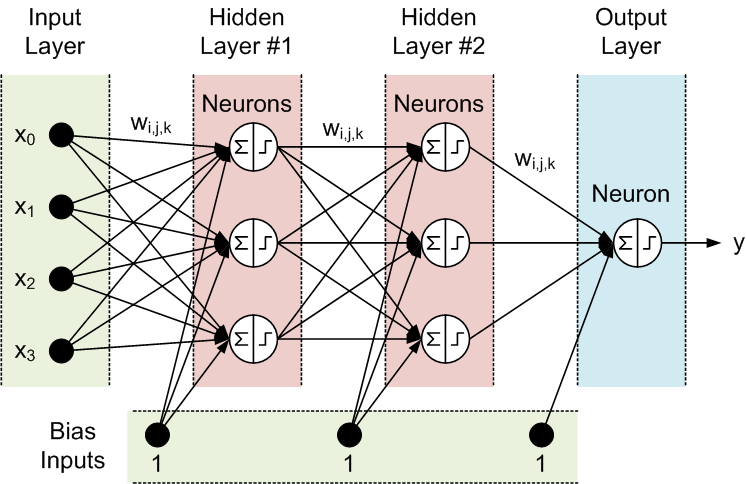

Key Concepts:
- Neurons: **A computational unit that processes input data and produces an output**. Neurons receive input signals, perform calculations on them, and generate an output signal. **Artificial neurons, often called nodes**. ANNs consist of interconnected nodes, called artificial neurons and are organized in layers. 
- Connections: These neurons are linked by connections that have associated weights, which determine the strength of the connection. Weights determine the strength of connection between neurons.
- Learning: The network learns by adjusting these weights based on input data and desired outputs, a process often involving backpropagation. 
- Layers: ANNs typically have an input layer, one or more hidden layers, and an output layer. **Groupings of interconnected nodes (artificial neurons) that process data in a specific way**
- Activation Functions: Each neuron applies an activation function to the weighted sum of its inputs, determining the neuron's output. 

### How ANN work
How it works:
1. Input: Data is fed into the input layer of the network. 
2. Processing: The input is passed through the hidden layers, where each neuron performs calculations based on its connections and activation function. 
3. Output: The final layer produces the network's output, which is the result of the computations. 
4. Learning: The network compares its output to the desired output and adjusts the connection weights to minimize the difference, improving its accuracy over time. (ANNs are trained using the backpropagation algorithm)

#### How ANNs are trained

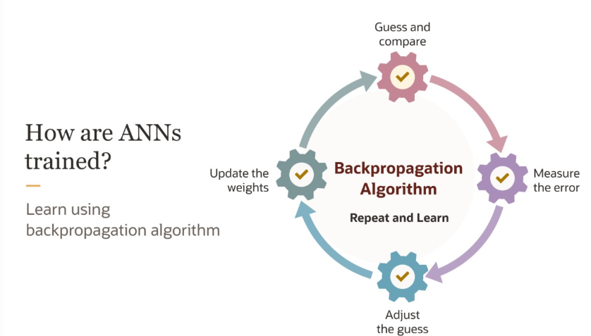
In the training of the picture for digits, During the guess and compare, the guess is what the model gave say digit '6' for input '4' and it is compared with the desired result of '4'. Now, the error is measured and the weights are adjusted.
By showing thousands of images and adjusting the weights iteratively, ANN is able to predict the output for most of the images. **This process of adjusting the weights using the backprogration algorithm is how the ANNs are trained.**

### Deep Learning Models
Deep learning models can be broadly categorized based on their ability to handle sequential data, distinguishing between sequence models and non-sequence models.

**Broad Classification of Deep Learning Models**
- Sequence Models
- Non-Sequence Models

**Deep learning algorithms for sequential problems**
- Recurrent Neural Network (RNN)
- Long Short-Term Memory (LSTM) 
- Gated Recurrent Unit (GRU) Networks
- Transformers

**Deep learning algorithms for non-sequential problems**
- Convolutional Neural Network (CNN)
- Feedforward Neural Networks (FNNs) / Multi-Layer Perceptrons (MLPs)
- Autoencoders (AEs)
- Deep Belief Networks (DBNs)
- Generative Adversarial Networks (GANs)

#### Sequence Models
Sequential models deal with **ordered data** where the order or sequence of the input matters. These models are widely used in tasks where **context from previous data points affects the output**. These problems are prevalent in areas such as natural language processing (NLP) for tasks like machine translation, sentiment analysis, text generations, time series analysis, speech recognition to convert recorded audio to text and more
Characteristics:
- **Order Matters**: Data is processed in a sequence, maintaining the context of past or future inputs.
- **State Dependency**: Outputs depend on previous inputs (e.g., in time-series forecasting or text generation).

#### Non-Sequential Models
Non-sequential models handle unordered data, where the relationships or patterns within the data do not depend on sequence or time.
Characteristics:
- **Order Doesn’t Matter**: Data is treated as independent points, with no dependency on previous or future data points.
- **No Memory Component**: These models process inputs independently.
- **Global Relationships**: Focus on capturing global patterns or relationships between features.

Key Differences between Sequence and Non-sequential models:
- Input Dependency: Sequential models rely on the order of input data, where past or future inputs influence the output. Non-sequential models process each input independently, without considering any sequence.
- Order Sensitivity: Sequential models are sensitive to the order of the data, as the sequence provides context. Non-sequential models treat data as unordered, where the order of inputs does not matter.
- Architecture: Sequential models use architectures like RNNs, LSTMs, GRUs, or Transformers, which are designed to handle dependencies over time. Non-sequential models include decision trees, support vector machines, convolutional neural networks (CNNs), and feedforward neural networks (FNNs).
- Applications: Sequential models are ideal for tasks like time-series forecasting, natural language processing, and speech recognition. Non-sequential models are suited for static tasks like image classification, tabular data analysis, and clustering.
- Complexity: Sequential models are generally more complex due to the need to handle memory, attention, and dependencies. Non-sequential models are typically simpler, focusing on global patterns or relationships.

## GenAI and LLM Foundations

Generative AI is a subset of Deep Learning where the models are trained to generate output / create content on their own. The newly created content can be images, text, music/audio, videos.

New Content: Text Generation, Image Generation, Video Generation etc.,

#### Introduction to Generative AI

Learns the underlying patterns in a given dataset and **create/generate new data** that shares those patterns. Under the hood, lot of mathematics is involved.

**Model Training - Supervised ML** - Learning new capability from existing data. During training, the model learns the relationship from the input features and the corresponding output labels from the provided training dataset. After it is trained, the model can make predictions. **Inference is the process of making predictions for a new data point using the trained model.**

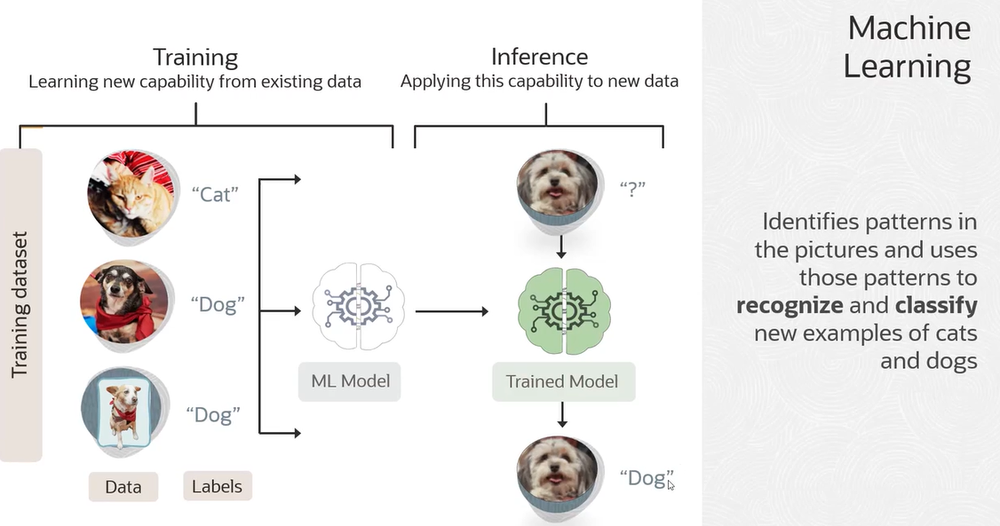

**How Gen AI is different from Supervised ML**  
In case Gen AI, it doesn't require any labelled data for training. Learn patterns from unstructed content to produce new content

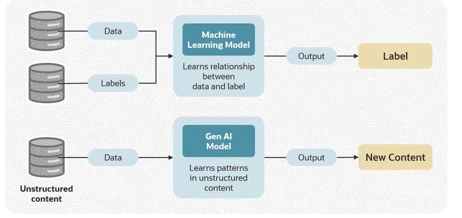

**Types of GenAI models**  
- **Text Based models** - Can generated text,code, dialogue, articles, poems etc., Learns from large collections of text data to capture patterns, language structures and semantic relationships
- **Multimodal models** - Generate multiple modalities like text, images, audio and video.

#### Introduction to Large Language Models

LLM - A language model (LM) is a probabilistic model of text. The Large in LLM refers to the number of parameters. LLM are based on a Deep Learing architecture called Transformer. LLMs are deep neural networks trained on massive amounts of text/data namely the publicly available data.

In LLM, **Parameters are adjustable weights in the model's neural network**. Model size is the memory required to store the model's parameters.

#### Transformer Architecture


#### Prompt Engineering

Prompt is the input or initial text provided to the model to get back the Generated Text.  
Prompt Engineering is the process of iteratively refining the prompt for the purpose of eliciting a particular style of response.

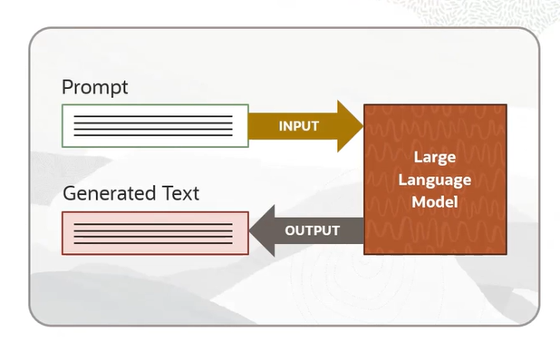

Instruction tuning is a critical step in LLM alignment. It involves fine-tuning a pre-trained LLM on a varied set of instructions, each paired with a desired output.

In the both the below cases of prompting technique, it is not learning in true sense as none of the paramters of the model are changed  
- **In-context Learning and Few-shot prompting** - Conditioning an LLM with instructions and or **demonstrations of the task it is meant to complete**. k-shot prompting..0-shot promting, 1-shot prompting to a k-shot prompting
- **Chain of thought prompting** - Break the prompt **(problem) into small chucks** like how you approach to solve each of the small problems.


Hallucination - Model generated text that is non-factual and/or ungrounded into any data that the model is exposed to. Some methods that are claimed to reduce hallucination (eg., RAG)

#### Customize LLMs with your data

- **Prompt Engineering** - Context Optimization (What the model needs to know)
- **Retrieval-Augmented Generation (RAG)** 
- **Fine-tuning** 

**Retrieval Augument Generation (RAG)**

Language model can query enterprise knowledge bases (databases, wikis, vector databases) to provide grounded responses. RAG does not require fine-tuning. RAG gives **access to private knowledge** which otherwise will not be available for the LLMs. 

Two major components of RAG  
- Retrieval refers to the access to private knowledge base or Enterprise vector database or other corpus of information relevant to the user.
- Augmented Generation. Here, we are using the information retrieved to form a more informed response. Here, we are giving the LLM access to private knowledge which otherwise will not be available for the LLM.  

**Fine Tuning**

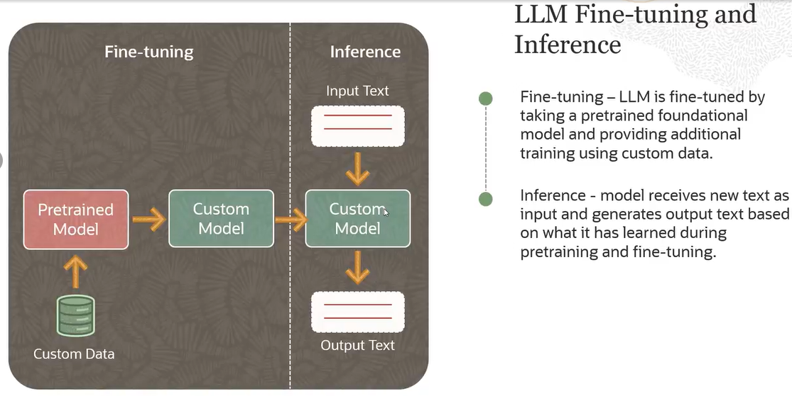

Used when you want to teach your LLM something new. Customize the model to domain-specific data and generate contextually relevant responses. Improve model performance for specific tasks.

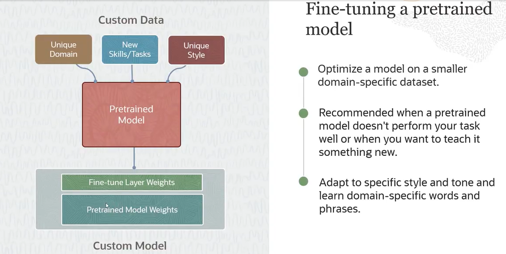

**Which customization technique to use**

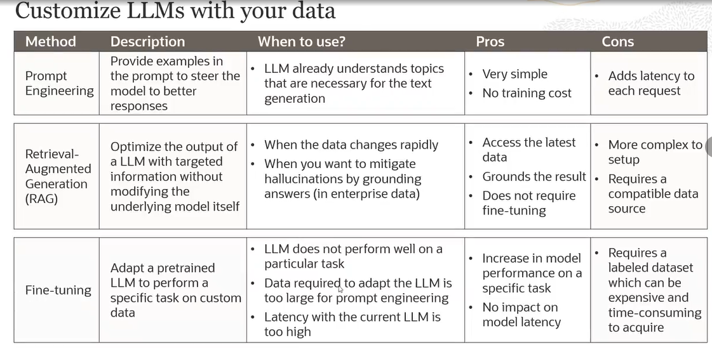


## OCI AI Portfolio

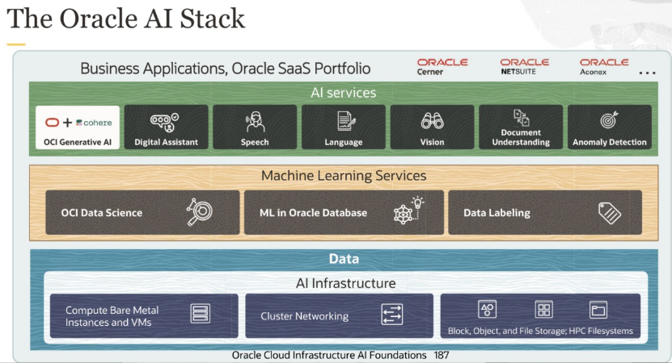

Oracle Cloud Infrastructure (OCI) Data Science is a fully managed and serverless platform for **data science teams to build, train, and manage machine learning models.**

### OCI Datascience

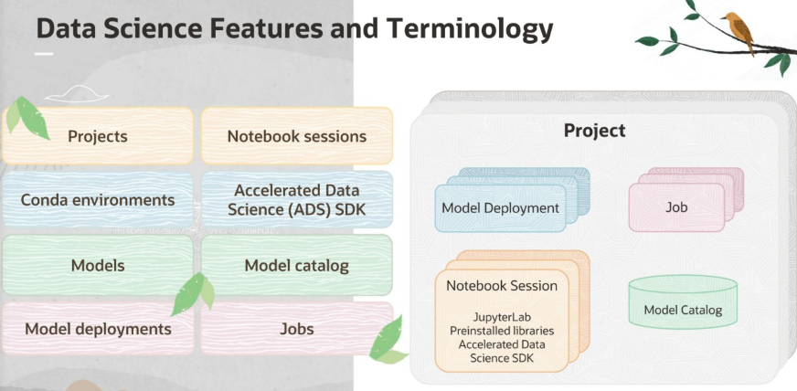

#### Ways to access Data science
- OCI console - Browser based and Notebook sessions
- Rest API
- Language SDKs
- CLI

#### OCI data science
- Build,train and deploy ML models
- Used by Data scientist throughout the ML lifecycle
- Juypterlab notebook interface
- Model Catalog - A centralized repository for storing and managing trained models. 
- Jobs
- Model deployments

#### Model Deployments
When you deploy a model, you select the shape type and the number of replicas hosting the model servers. You can also select the load balancer bandwidth associated with the deployment.

Deploying a machine learning model on Oracle Cloud Infrastructure (OCI) and **accessing it via a REST endpoint** involves using the **OCI Data Science service's Model Deployment feature**.

#### Models
**Model Catalog is a centralized repository for storing and managing trained models.** When you **save a model to the model catalog**, you're charged for the storage of the model artifact at the standard Object Storage rates in terms of GB per month.  When you delete a model, you're no longer charged

#### Jobs
Oracle Cloud Infrastructure (OCI) Data Science Jobs (Jobs) enables you to **define and run repeatable machine learning tasks on a fully managed infrastructure**. You can create a compute resource on demand and run applications that perform tasks such as data preparation, model training, hyperparameter tuning, and batch inference.

### AI Infrastructure


## OCI Gen AI Services

## OCI AI Services

### Language
- **Language Detection** - Detects the language of your text - Recognizes close to 75 languages
- **Named Entity Extraction (NER)** - Identifies entities in Text like Names, places, currency, dates, email, phone numbers etc., Highlights the Entity, Type of Entity and Confidence Level
- **Sentiment Analysis** - (Document level sentiment, Aspect based sentiment, Sentence level sentiment) - Identifies sentiment for each aspect of text and the sentiment of every sentence or the subject as a whole
- **Key phrase extraction** - Identifies key phrases that represent important ideas or subjects
- **Text Classification** - Classifies general topic from list of 600 categories and subcategories

Sentiment Analysis:


The above example shows two aspects in one review. About the ```food``` and the ```service```

### Speech  

(Currently support English, Spanish and Portuguese)

- Transcribes audio and video files using deep learning techniques
- Process the data directly in Object storage and generates timestamped accurate transcriptions.
- Punctuates transcriptions to make text more readable
- SRT closed caption file support

**Normalization**:  Making transcribe text more readable to resemble how humans write. This includes address, date, time, numbers, urls etc.,  

Unnormalized --> Normalized
This laptop costs on thousand three hundred and fifty-five dollars --> This laptop costs $1,355

**Profanity Filtering**  
Remove or Tag or Mask the text in the output text.  
Masking is a straightforward method of obscuring offensive words, while tagging provides a way to identify and label them for further actions.

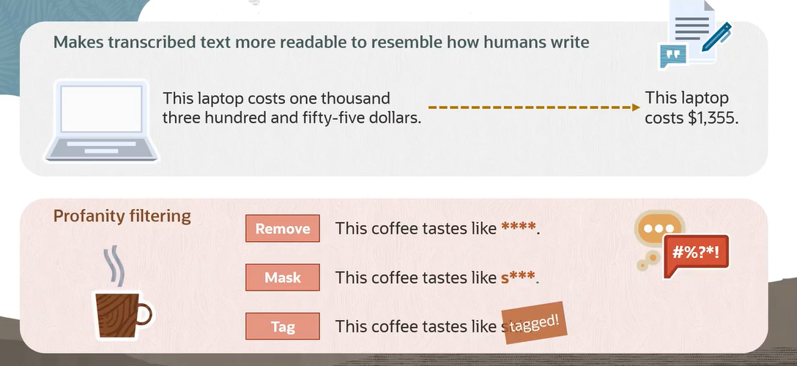

### Vision
Vision services is about Image Classification, Object detection and Document AI

- **Object Detection** - Detect objects inside a image and give a bounding box with a label for it with a accuracy percentage. It also extracts all the Text inside the image like Car license plate numbers, advetisements, building name  
- **Image Classification** - Labels the scene  

### Document Understanding
Understand PDFs, JPEG, PNG etc which has textual information
- **Text Recognition** - Extracts text from Images  
- **Document Classification** - Parses document into 10 different types based on appearance like Resume, Receipt/Invoice etc.,  
- **Language Detection** - Visual features of text rather than text itself to get the language
- **Table Extraction** - Identifies and extracts from invoices, POs and receipts  
- **Key Value Extraction** - Finds values for 13 common fields and line items in receipts like Merchant Name, transaction date etc.,

Key Value Extraction 

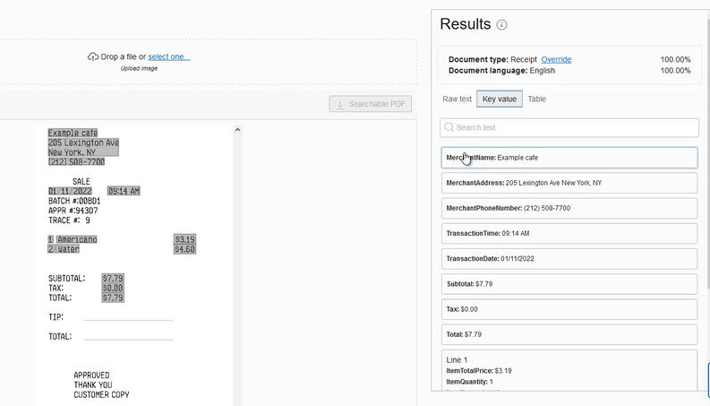


Tabular Value Extraction

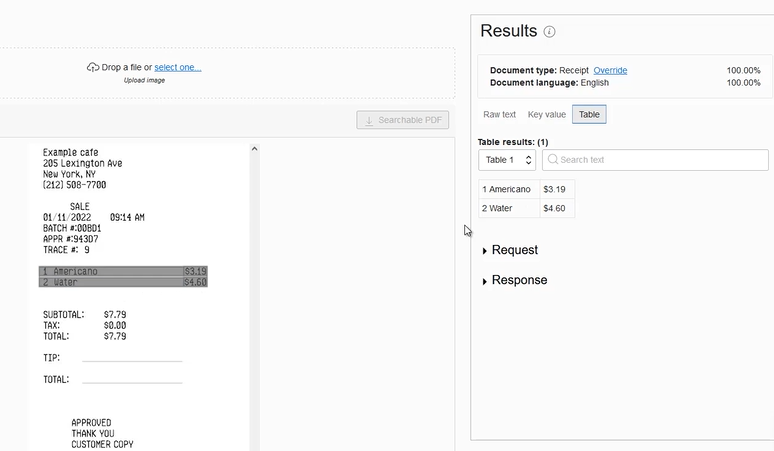


## Reference
- https://github.com/debabrata2050/Oracle-Certificate
- https://www.youtube.com/watch?v=15aLvsG5tlg
- https://www.youtube.com/watch?v=3PYeGBX-EkU
- https://www.youtube.com/watch?v=53AwXHyC7SE
- https://www.edushots.com/Machine-Learning/unsupervised-machine-learning-overview
- https://www.youtube.com/watch?v=S7oA5C43Rbc