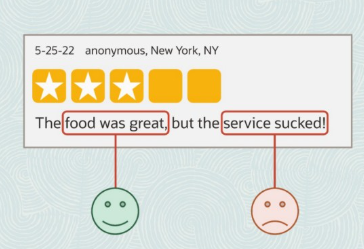

## AI Fundations


## Machine Learning Foundations


- Supervised machine learning is about **extracting trends and rules from data**
- Unsupervised machine learning **explore patterns to group similar data into clusters**
- Reinforcement machine learning is **learning from outcomes to make decisions**

### Supervised Machine Learning

Supervised Machine Learning is a type of machine learning where an **algorithm is trained on a labeled dataset**. The training dataset includes input data along with the correct output(label). **The goal of supervised learning is for the model to learn the mapping between inputs and outputs so that it can accurately predict the output for new and unseen data.**

Both input and output are clearly specified with labeled data. It is similar to learning under the supervision of a teacher. **Supervised Machine Learning learns from labeled data**. The model learns the mapping between the input and the output.

Types of Supervised Machine learning
- **Classification (Predict categories)**
  - Binary Classification (Predict one of the two possible classes - Spam/Not Spam, True/False)
  - Multi-Class Classification (Predicts one of more than two possible classes)
  - Multi-Label Classification 
- **Regression (Predict continuous numerical value)**
  - Linear Regression
  - Polynomial Regression
  - Support Vector Regression


#### Classification
A supervised ML technique used to categorize or assign data points into predefined classes/categories based on their features or attributes. Classifier is trained on a labelled dataset.

**List of Classification algorithms**
- Logistic Regression
- Decision Trees
- Random Forest
- KNN (K-Nearest Neighbours)
- Naive Bayes
- Support Vector Machines

**Logistic Regression**

Helps to predict if something is true or false. Instead of fitting a straight line to the data as in the case of linear regression. Logistic regression fits an S-Shaped curve called ```sigmoid function``` to fit the data.

#### Regression

**List of Regression algorithms**
- Linear Regression
- 


Important Notes:
- Logistic Regression. **Though it has the name regression, it is a Classification and not regression**. Logistic Regression is a binary classification algorithm.

### Unsupervised Machine Learning

Unsupervised Machine Learning is a type of machine learning where **algorithms learn from unlabeled data**, uncovering hidden patterns and structures without explicit guidance. **The goal of unsupervised learning is exploring and grouping similar data into clusters**

### Reinforcement Machine Learning

Reinforcement machine learning (RL) is a type of machine learning where an agent learns to make decisions by interacting with an environment and receiving rewards or penalties for its actions

The goal is for the agent to learn a policy (a strategy for choosing actions) that maximizes the cumulative reward over time. Think of it like training a dog: you give treats for good behavior and scold for bad behavior, and the dog learns to associate certain actions with positive outcomes. 

Primary purpose of reinforcement machine learning is **learning from outcomes to make decisions**

## Deep Learning Foundations

Deep learning is a subset of ML that focuses on training Artifical Neural Networks (ANNs) with multiple layers. Example: Image Classification, Computer Vision, NLP, Speech recognition, Text Translation, Another Subset of AI (Gen AI)

ML needs us to specify features whereas **DL automatically extracts features from raw and complex data**. Use the extracted features to build internal representation which is not possible to do it manually.

DL is a subset of ML for which features cannot be described easily.

### What is Artificial Neural Network
An artificial neural network (ANN) is a computational model inspired by the structure and function of the human brain's neural networks. It's designed to process information by learning from data, rather than through explicit programming


Key Concepts:
- Neurons: **A computational unit that processes input data and produces an output**. Neurons receive input signals, perform calculations on them, and generate an output signal. **Artificial neurons, often called nodes**. ANNs consist of interconnected nodes, called artificial neurons and are organized in layers. 
- Connections: These neurons are linked by connections that have associated weights, which determine the strength of the connection. Weights determine the strength of connection between neurons.
- Learning: The network learns by adjusting these weights based on input data and desired outputs, a process often involving backpropagation. 
- Layers: ANNs typically have an input layer, one or more hidden layers, and an output layer. **Groupings of interconnected nodes (artificial neurons) that process data in a specific way**
- Activation Functions: Each neuron applies an activation function to the weighted sum of its inputs, determining the neuron's output. 

### How ANN work
How it works:
1. Input: Data is fed into the input layer of the network. 
2. Processing: The input is passed through the hidden layers, where each neuron performs calculations based on its connections and activation function. 
3. Output: The final layer produces the network's output, which is the result of the computations. 
4. Learning: The network compares its output to the desired output and adjusts the connection weights to minimize the difference, improving its accuracy over time. (ANNs are trained using the backpropagation algorithm)

#### How ANNs are trained


In the training of the picture for digits, During the guess and compare, the guess is what the model gave say digit '6' for input '4' and it is compared with the desired result of '4'. Now, the error is measured and the weights are adjusted.
By showing thousands of images and adjusting the weights iteratively, ANN is able to predict the output for most of the images. **This process of adjusting the weights using the backprogration algorithm is how the ANNs are trained.**

### Deep Learning Models
Deep learning models can be broadly categorized based on their ability to handle sequential data, distinguishing between sequence models and non-sequence models.

**Broad Classification of Deep Learning Models**
- Sequence Models
- Non-Sequence Models

**Deep learning algorithms for sequential problems**
- Recurrent Neural Network (RNN)
- Long Short-Term Memory (LSTM) 
- Gated Recurrent Unit (GRU) Networks
- Transformers

**Deep learning algorithms for non-sequential problems**
- Convolutional Neural Network (CNN)
- Feedforward Neural Networks (FNNs) / Multi-Layer Perceptrons (MLPs)
- Autoencoders (AEs)
- Deep Belief Networks (DBNs)
- Generative Adversarial Networks (GANs)

#### Sequence Models
Sequential models deal with **ordered data** where the order or sequence of the input matters. These models are widely used in tasks where **context from previous data points affects the output**. These problems are prevalent in areas such as natural language processing (NLP) for tasks like machine translation, sentiment analysis, text generations, time series analysis, speech recognition to convert recorded audio to text and more
Characteristics:
- **Order Matters**: Data is processed in a sequence, maintaining the context of past or future inputs.
- **State Dependency**: Outputs depend on previous inputs (e.g., in time-series forecasting or text generation).

#### Non-Sequential Models
Non-sequential models handle unordered data, where the relationships or patterns within the data do not depend on sequence or time.
Characteristics:
- **Order Doesn’t Matter**: Data is treated as independent points, with no dependency on previous or future data points.
- **No Memory Component**: These models process inputs independently.
- **Global Relationships**: Focus on capturing global patterns or relationships between features.

Key Differences between Sequence and Non-sequential models:
- Input Dependency: Sequential models rely on the order of input data, where past or future inputs influence the output. Non-sequential models process each input independently, without considering any sequence.
- Order Sensitivity: Sequential models are sensitive to the order of the data, as the sequence provides context. Non-sequential models treat data as unordered, where the order of inputs does not matter.
- Architecture: Sequential models use architectures like RNNs, LSTMs, GRUs, or Transformers, which are designed to handle dependencies over time. Non-sequential models include decision trees, support vector machines, convolutional neural networks (CNNs), and feedforward neural networks (FNNs).
- Applications: Sequential models are ideal for tasks like time-series forecasting, natural language processing, and speech recognition. Non-sequential models are suited for static tasks like image classification, tabular data analysis, and clustering.
- Complexity: Sequential models are generally more complex due to the need to handle memory, attention, and dependencies. Non-sequential models are typically simpler, focusing on global patterns or relationships.

## GenAI and LLM Foundations

Generative AI is a subset of Deep Learning where the models are trained to generate output / create content on their own. The newly created content can be images, text, music/audio, videos.

New Content: Text Generation, Image Generation, Video Generation etc.,

Learns the underlying patterns in a given dataset and generate new data that shares those patterns.

## OCI AI Portfolio

## OCI Gen AI Services

## OCI AI Services

### Language
- Language Detection - Detects the language of your text - Recognizes close to 75 languages
- Named entity recognition - Identifies entities in Text like Names, places, currency, dates, email, phone numbers etc.,
- Sentiment Analysis - (Document level sentiment, Aspect based sentiment, Sentence level sentiment) - Identifies sentiment for each aspect of text and the sentiment of every sentence or the subject as a whole
- Key phrase extraction - Identifies key phrases that represent important ideas or subjects
- Classifies general topic from list of 600 categories and subcategories


Sentiment Analysis:


The above example shows two aspects in one review. About the ```food``` and the ```service```


### Reference
- https://github.com/debabrata2050/Oracle-Certificate
- https://www.youtube.com/watch?v=15aLvsG5tlg
- https://www.youtube.com/watch?v=3PYeGBX-EkU
- https://www.youtube.com/watch?v=53AwXHyC7SE
- https://www.edushots.com/Machine-Learning/unsupervised-machine-learning-overview
- https://www.youtube.com/watch?v=S7oA5C43Rbc