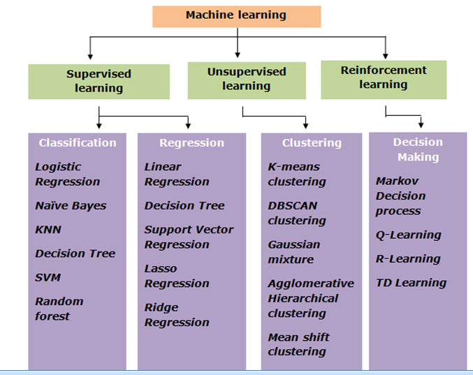

## AI Fundations


## Machine Learning Foundations




- Supervised machine learning is about **extracting trends and rules from data**
- Unsupervised machine learning **explore patterns to group similar data into clusters**
- Reinforcement machine learning is **learning from outcomes to make decisions**

### Supervised Machine Learning

Supervised Machine Learning is a type of machine learning where an **algorithm is trained on a labeled dataset**. The training dataset includes input data along with the correct output(label). **The goal of supervised learning is for the model to learn the mapping between inputs and outputs so that it can accurately predict the output for new and unseen data.**

Both input and output are clearly specified with labeled data. It is similar to learning under the supervision of a teacher. **Supervised Machine Learning learns from labeled data**. The model learns the mapping between the input and the output.

Types of Supervised Machine learning
- **Classification (Predict categories)**
  - Binary Classification (Predict one of the two possible classes - Spam/Not Spam, True/False)
  - Multi-Class Classification (Predicts one of more than two possible classes)
  - Multi-Label Classification 
- **Regression (Predict continuous numerical value)**
  - Linear Regression
  - Polynomial Regression
  - Support Vector Regression


#### Classification
A supervised ML technique used to categorize or assign data points into predefined classes/categories based on their features or attributes. Classifier is trained on a labelled dataset.

Classification algorithms
- Logistic Regression
- 

**Logistic Regression**
Helps to predict if something is true or false. Instead of fitting a straight line to the data as in the case of linear regression. Logistic regression fits an S-Shaped curve called ```sigmoid function``` to fit the data.


#### Regression


Important Notes:
- Logistic Regression. **Though it has the name regression, it is a Classification and not regression**. Logistic Regression is a binary classification algorithm.

### Unsupervised Machine Learning

Unsupervised Machine Learning is a type of machine learning where **algorithms learn from unlabeled data**, uncovering hidden patterns and structures without explicit guidance. **The goal of unsupervised learning is exploring and grouping similar data into clusters**

### Reinforcement Machine Learning

Reinforcement machine learning (RL) is a type of machine learning where an agent learns to make decisions by interacting with an environment and receiving rewards or penalties for its actions

The goal is for the agent to learn a policy (a strategy for choosing actions) that maximizes the cumulative reward over time. Think of it like training a dog: you give treats for good behavior and scold for bad behavior, and the dog learns to associate certain actions with positive outcomes. 

Primary purpose of reinforcement machine learning is **learning from outcomes to make decisions**

## Deep Learning Foundations

Deep learning is a subset of ML that focuses on training Artifical Neural Networks (ANNs) with multiple layers. Example: Image Classification, Computer Vision, NLP, Speech recognition, Text Translation, Another Subset of AI (Gen AI)

ML needs us to specify features whereas **DL automatically extracts features from raw and complex data**. Use the extracted features to build internal representation which is not possible to do it manually.

DL is a subset of ML for which features cannot be described easily.

### What is Artificial Neural Network
An artificial neural network (ANN) is a computational model inspired by the structure and function of the human brain's neural networks. It's designed to process information by learning from data, rather than through explicit programming

Key Concepts:
- Neurons: ANNs consist of interconnected nodes, called artificial neurons, organized in layers. 
- Connections: These neurons are linked by connections that have associated weights, which determine the strength of the connection. 
- Learning: The network learns by adjusting these weights based on input data and desired outputs, a process often involving backpropagation. 
- Layers: ANNs typically have an input layer, one or more hidden layers, and an output layer. 
- Activation Functions: Each neuron applies an activation function to the weighted sum of its inputs, determining the neuron's output. 

### How ANN work
How it works:
1. Input: Data is fed into the input layer of the network. 
2. Processing: The input is passed through the hidden layers, where each neuron performs calculations based on its connections and activation function. 
3. Output: The final layer produces the network's output, which is the result of the computations. 
4. Learning: The network compares its output to the desired output and adjusts the connection weights to minimize the difference, improving its accuracy over time. (ANNs are trained using the backpropagation algorithm)


In the training of the picture for digits, During the guess and compare, the guess is what the model gave say digit '6' for input '4' and it is compared with the desired result of '4'. Now, the error is measured and the weights are adjusted.
By showing thousands of images and adjusting the weights iteratively, ANN is able to predict the output for most of the images. **This process of adjusting the weights using the backprogration algorithm is how the ANNs are trained.**


## GenAI and LLM Foundations

## OCI AI Portfolio

## OCI Gen AI Services

## OCI AI Services


### Reference
- https://github.com/debabrata2050/Oracle-Certificate
- https://www.youtube.com/watch?v=15aLvsG5tlg
- https://www.youtube.com/watch?v=3PYeGBX-EkU
- https://www.youtube.com/watch?v=53AwXHyC7SE
- https://www.edushots.com/Machine-Learning/unsupervised-machine-learning-overview