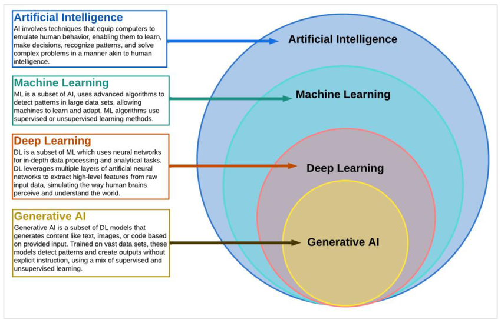

## AI Fundations

## Machine Learning Foundations

### Supervised Machine Learning

Supervised Machine Learning is a type of machine learning where an **algorithm is trained on a labeled dataset**. The training dataset includes input data along with the correct output(label). **The goal of supervised learning is for the model to learn the mapping between inputs and outputs so that it can accurately predict the output for new and unseen data.**

Both input and output are clearly specified with labeled data. It is similar to learning under the supervision of a teacher. **Supervised Machine Learning learns from labeled data**

Types of Supervised Machine learning
- **Classification (Predict categories)**
  - Binary Classification (Predict one of the two possible classes - Spam/Not Spam, True/False)
  - Multi-Class Classification (Predicts one of more than two possible classes)
  - Multi-Label Classification 
- **Regression (Predict continuous numerical value)**
  - Linear Regression
  - Polynomial Regression
  - Support Vector Regression

In nutshell, Supervised machine learning extract trends and rules from data

### Unsupervised Machine Learning

Unsupervised Machine Learning is a type of machine learning where **algorithms learn from unlabeled data**, uncovering hidden patterns and structures without explicit guidance. **The goal of unsupervised learning is exploring and grouping similar data into clusters**

In nutshell, Unsupervised machine learning explore patterns to group similar data into clusters

### Reinforcement Machine Learning

Reinforcement machine learning (RL) is a type of machine learning where an agent learns to make decisions by interacting with an environment and receiving rewards or penalties for its actions

The goal is for the agent to learn a policy (a strategy for choosing actions) that maximizes the cumulative reward over time. Think of it like training a dog: you give treats for good behavior and scold for bad behavior, and the dog learns to associate certain actions with positive outcomes. 

Primary purpose of reinforcement machine learning is **learning from outcomes to make decisions**

## Deep Learning Foundations

## GenAI and LLM Foundations

## OCI AI Portfolio

## OCI Gen AI Services

## OCI AI Services

### Reference
- https://github.com/debabrata2050/Oracle-Certificate
- https://www.youtube.com/watch?v=15aLvsG5tlg
- https://www.youtube.com/watch?v=3PYeGBX-EkU
- https://www.youtube.com/watch?v=53AwXHyC7SE